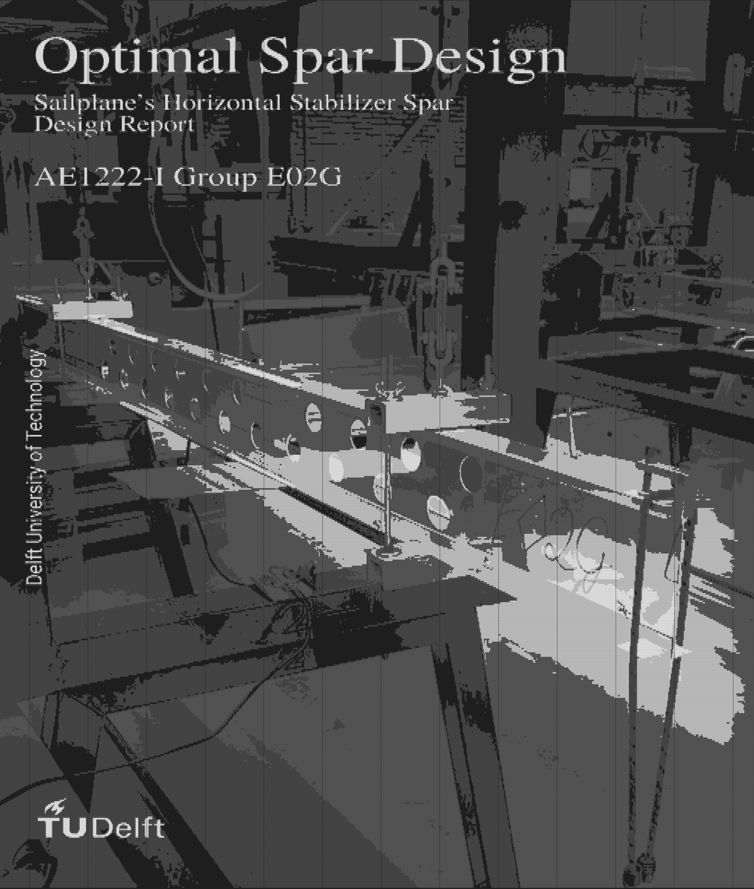
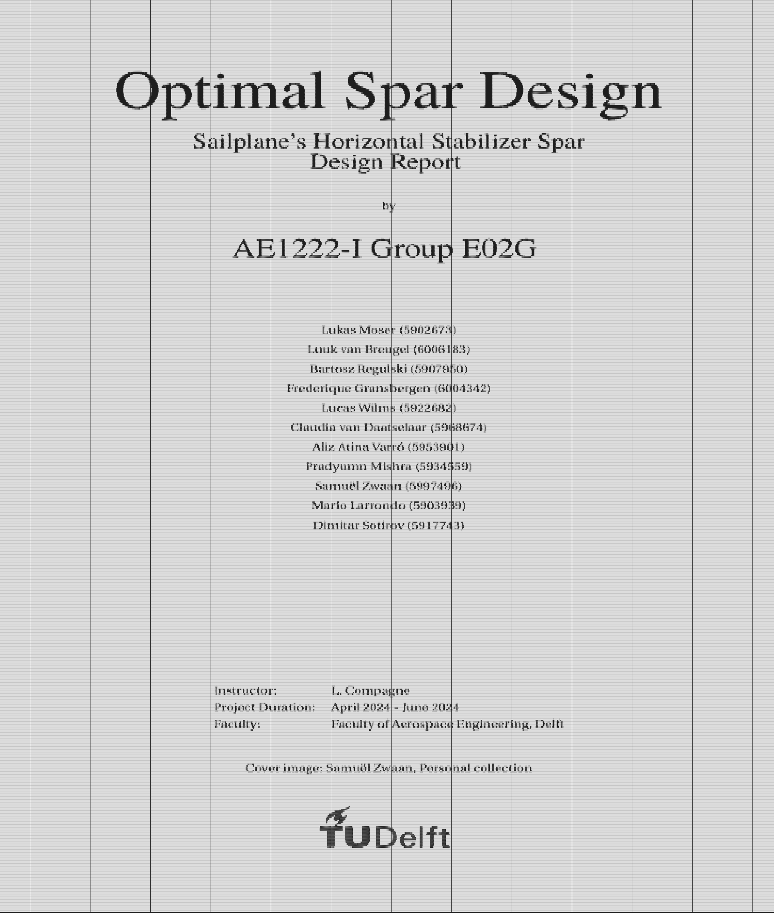

  
   

# ascii-art

This is a simple Python script to convert images to grayscale and do a 2D convolution to generate ascii art.

## Usage

Import or go to `main.py` to run these functions, which output a console-style rendered .png or .pdf file:

    convert_img('swarm_of_drones.jpg', kernel_size=(3, 5)), font_size=10
    convert_pdf('E02G_Wing_spar.pdf', kernel_size=(2, 4), font_size=5)

Modify `font_path` in the code as needed, as well as other settings.

You can also just call `print(get_frame_stringified(..))` to print directly to console without outputting to a file.

`main.py` also contains functions to play videos in the console or hook-up a webcam to render live on the console.
